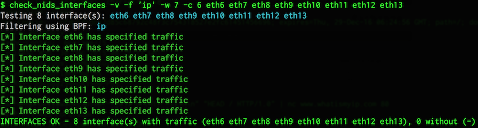

# check_nids_interfaces

Nagios plugin designed to passively check capture interfaces receiving desired
traffic flows.

## Overview

**check_nids_interfaces** is a Nagios plugin designed to test NIDS sensor
network capture interfaces for specified traffic in order to check if the
interface is receiving monitored flows. The plugin's purpose is to aid with
the problem of monitoring what is effectively a passive service; when network
flows cease to arrive at passive monitoring devices, there is seldom a
noticable service outage. Even a partial outage may go undetected, if at least
a single link is functioning and feeding traffic to the device. This plugin is
designed to make passive traffic inspection a monitorable service.

## How it works

The plugin is a shell script that conforms to the Nagios plugin API.
Specified network interfaces are checked in sequence by attaching *tcpdump(8)*
to them and using a BPF to listen for desired traffic. If the number of
interfaces that do present that traffic don't meet the given thresholds,
WARNING or CRITICAL status is returned along with output summarizing the
issue. Here's an example:

    $ check_nids_interfaces -p 80/tcp -w 7 -c 6 eth6 eth7 eth8 eth9 eth10 eth11 eth12 eth13 
    INTERFACES OK - 8 interface(s) with traffic (eth6 eth7 eth8 eth9 eth10 eth11 eth12 eth13), 0 without (-)

This plugin is also designed so that it may be run manually using the
`-v' option for verbose output. This makes use of colorized terminal output
using the [bash_colors][bc] library and is useful when spot checking and
troubleshooting traffic health interactively.

## Requirements

- Bash (version 4)
- tcpdump
- [bash_colors][bc] terminal color library

## Setup

1. Copy the plugin into the plugins directory.
2. Install a copy of the bash_colors somewhere in `PATH` (using the name
   `bash_colors`).

This plugin is designed to be run as an unprivileged user on Linux, so on that
platform the *tcpdump(8)* binary may have the proper capabilities(7) set,
typically with the following command:

    # setcap cap_net_raw,cap_net_admin=eip /usr/sbin/tcpdump

Otherwise, and on other platforms, it will work under *sudo(8)* instead.

## Usage notes

Run the script with the `-h` (help) option to see usage information. In the
standard case, the plugin must be provided with a traffic filter
specification, warning and critical thresholds, and a list of interface names.

The traffic filter specification may be given using the `-p` option as a
"protocol spec", using the standard service specification for a TCP or UDP
port in the form *port/proto*, as in *80/tcp*. This is then converted to a
valid BPF expression. Alternatively, an explicit BPF filter may be given using
the `-f` option, as in `-f 'tcp and port (80 or 443)'`. Unless the monitored
traffic is passed through devices that filter or otherwise selectively forward
specific traffic, the best strategy is probably to specify a common service
for the monitored segments or listen for any traffic (`-f ip`).

Thresholds should be specified by the number of interfaces that receive
traffic to return the given status. For example, if 8 interfaces are checked,
and thresholds are given as `-w 7 -c 6`, the plugin will return WARNING status
if one interface is not receiving traffic, or CRITICAL if two or more are not.

By default, the plugin captures traffic on the interface for about one second.
Some network segments may not forward desired traffic in high volume, so it
may be desirable to increase the capture duration to greater than one second.
This can be done using the `-d` option, as in `-d 3`. Be aware that while this
increases the possibility of receiving the desired traffic, it also compounds
the time required for the plugin to complete execution, thus increasing the
chance that the plugin could exceed its allotted execution time.

[bc]: https://github.com/maxtsepkov/bash_colors

